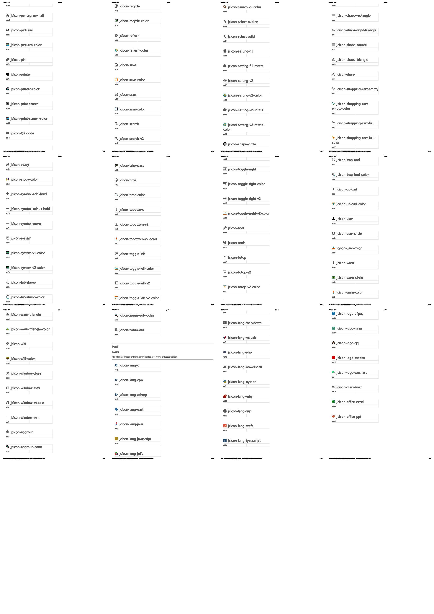

# jc-icons-vue

This is an icon library for Vue framework, in which all font icons are drawn by the library author himself.

# Install

## npm

```shell
npm i jc-icons-vue
```

## yarn

```shell
yarn add jc-icons-vue
```

## pnpm 
```shell
pnpm install jc-icons-vue
```

# All Icons





# Usage

## global register
```ts
// mian.ts
import { createApp } from 'vue';

import App from './App.vue'
import { JCICons } from 'jc-icons-vue';

function bootstrap() {
    const app = createApp(App)
    app.use(JCICons);
    app.mount('#app');
}

bootstrap();
```

## use icons

You can specify the icon to use by giving the value of the name attribute, and the icon name does not need to use the prefix `jcicon-` .

```html
<jc-icon name="action-restore"></jc-icon>
<jc-icon name="action-undo"></jc-icon>
<jc-icon name="address-book"></jc-icon>
<jc-icon name="address-book-color"></jc-icon>
<jc-icon name="align-center"></jc-icon>
<jc-icon name="align-center-color"></jc-icon>
<jc-icon name="align-justify-color"></jc-icon>
<jc-icon name="align-left"></jc-icon>
<jc-icon name="align-left-color"></jc-icon>
<jc-icon name="align-right"></jc-icon>
<jc-icon name="align-right-color"></jc-icon>
```


# About the copyright of some icons

The library itself is open source and free, and the free use of icons is authorized by the content in LICENCE. But it doesn't mean that some icons with specific meanings can be used arbitrarily, because some of them are redraws of some trademarks that may be registered, such as github, chrome, python and other logos. When using such logos, please make sure you have permission to use them. All copyright problems caused by trademark registration, but not limited to trademarks, shall be borne by the icon users themselves.
